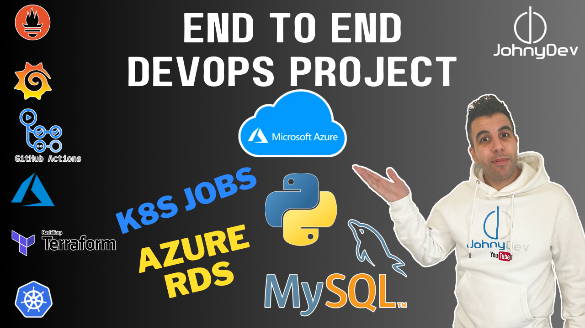

# End-to-End-DevOps-Azure-Python-MySQL



This project is a complete end-to-end DevOps pipeline to deploy a Python application with a Azure RDS on Azure Kubernetes Service (AKS). It leverages Terraform for infrastructure provisioning, Helm for Kubernetes application management, and ArgoCD for GitOps deployment. The monitoring stack, including Prometheus, Alertmanager, and Grafana, is also deployed using Helm.

It is a simple python web application `todo list` where it store the data you input on the web into the azure database.

## Project Structure

```
.
|
├── todo-app
    └── ...                     # Python application files and Dockerfile
├── k8s/                        # Deployment files
│   ├── app-deployment.yml      # Application deployment
│   └── app-service.yml         # Application service
├── terraform/                  # Terraform configuration files
│   ├── provider.tf
│   ├── aks.tf
│   └── ...
├── build.sh                    # Automate building infra and deployment
├── destroy.sh                  # Automate destroying infra and deployment
├── run_me_first.sh             # Automate creating Service Principal
└── README.md                   # Project Documentation
```

## Prerequisites

Before running this project, ensure you have the following installed:

- [Azure CLI](https://docs.microsoft.com/en-us/cli/azure/install-azure-cli)
- [Terraform](https://www.terraform.io/downloads.html)
- [kubectl](https://kubernetes.io/docs/tasks/tools/install-kubectl/)
- [Helm](https://helm.sh/docs/intro/install/)
- [Docker](https://www.docker.com/get-started)

## Infrastructure Provisioning

This project uses Terraform to provision the necessary infrastructure on Azure:

1. **Azure Kubernetes Service (AKS)**: A managed Kubernetes cluster to host your application.
2. **Azure Container Registry (ACR)**: A private registry to store Docker images.
3. **ArgoCD**: A GitOps tool to manage application deployment.
4. **Monitoring Stack**: Prometheus, Alertmanager, and Grafana for monitoring the cluster and applications.

## Deployment

The deployment process is automated using the `build.sh` script. The script performs the following tasks:

1. **Terraform Apply**: Runs `terraform apply` to provision the infrastructure on Azure.
2. **Docker Image Build**: Builds the Docker image for the Go application and pushes it to ACR.
3. **Helm Deployments**: Uses Helm to deploy ArgoCD, Prometheus, Alertmanager, and Grafana on AKS.
4. **Kubernetes Application Deployment**: Deploys the Go application and MongoDB to the AKS cluster.
5. **Retrieve LoadBalancer URL**: Fetches the URL of the LoadBalancer service created in the AKS cluster.

### Running the Script

1. Deploy the entire setup, start by running:

   First step, you need to create a file called `subscription.txt` in the root directory, that contains the **Subscription-ID** of your Azure account, just paste the id in the file, then run the `run_me_first.sh` script.

   ```
   ./run_me_first.sh
   ```

   This script will create a service principal app if it doesn't already exist, the output should look like this:

   `IMPORTANT: Make sure to save the output, you won't be able to get the Client Secret again`

   ```
   Service principal does not exist. Creating a new one...
   Client ID: xxxx-xxxx-xxxx-xxxx-xxxx
   Client Secret: xxxxxxxxxxxxxxxx
   Tenant ID: xxxx-xxxx-xxxx-xxxx-xxxx
   ```

2. Create `terraform.tfvars` inside `terraform` directory with the following values:

   ```
     client_id="xxxx-xxxx-xxxx-xxxx-xxxx"
     client_secret="xxxxxxxxxxxxxxxx"
     subscription_id="xxxx-xxxx-xxxx-xxxx-xxxx"
     tenant_id="xxxx-xxxx-xxxx-xxxx-xxxx"
     location="Azure Region"
   ```

   You can find the `subscription_id` by navigating to the `Azure Portal` then `Subscription`

3. Build the infrastructure and deploy using `build.sh` script:
   ```bash
   ./build.sh
   ```

## Accessing the Application

After the build script is executed, you should see the following:

### Infrastructure output:

```
Apply complete! Resources: 17 added, 0 changed, 0 destroyed.

Outputs:

acr_name = "cluster1devacr"
aks_cluster_location = "azure location"
aks_cluster_name = "cluster-1-dev-aks"
client_id = "xxxxxx-xxxxxx-xxxxxx-xxxxxx-xxxxxx"
client_secret = "xxxxxx-xxxxxx-xxxxxx-xxxxxx-xxxxxx"
db_host = "xx.xx.xx.xx"
db_password = <sensitive>
db_username = "sqladmin"
kube_config = <sensitive>
principal_id = "xxxxxx-xxxxxx-xxxxxx-xxxxxx-xxxxxx"
tenant_id = "xxxxxx-xxxxxx-xxxxxx-xxxxxx-xxxxxx"
```

### Application Deployment

```
--------------------Deploying App--------------------
deployment.apps/todo-app-deployment created
service/todo-app-service created
```

### Retrieving Application URLs

```
----------------------Application URL-----------------------
98.67.222.117:8080

------------------------ArgoCD URL--------------------------
98.67.219.216
-------------------- ArgoCD Credentials---------------------
┌─────────┬───────────────────────────┐
│  USER   │  PASSWORD                 │
├─────────┼───────────────────────────┤
│  admin  │ XXXXAXXXXTXXXpCt          │
└─────────┴───────────────────────────┘

----------------------Alertmanager URL----------------------
98.67.218.6:9093

-----------------------Prometheus URL-----------------------
98.67.219.209:9090

------------------------ Grafana URL------------------------
98.67.218.10
-------------------- Grafana Credentials--------------------
┌───────────────┬─────────────────────────┐
│  USER         │  PASSWORD               │
├───────────────┼─────────────────────────┤
│ admin         │ admin                   │
└───────────────┴─────────────────────────┘
```

## Post-Infrastructure Build

### 1. Connect to the Database

Use [Azure Data Studio](https://learn.microsoft.com/en-us/azure-data-studio/download-azure-data-studio?tabs=win-install%2Cwin-user-install%2Credhat-install%2Cwindows-uninstall%2Credhat-uninstall#download-azure-data-studio) to connect to your `Azure Database` and `Create a Connection`

  

Navigate to `Browse` > `Azure` > `Your Subscription`, you should see the created `Azure SQL Server`

  

Make sure you choose `Authentication Type` `SQL Login` and use the database `Username` and `Password`

Find the `Database Password` inside `Kubernetes Secrets` with the name `db-password`

  

### 2. Run Database Query

Once connected to the database navigate to `New Query` and run the following query:

```sql
BEGIN
    CREATE TABLE tasks (
        id INT IDENTITY(1,1) PRIMARY KEY,
        title NVARCHAR(255) NOT NULL,
        description NVARCHAR(MAX),
        is_complete BIT DEFAULT 0
    )
END
```

  

This will create a table inside the database `todo_db`

## Setting Up the CI Pipeline with GitHub Actions

This guide will walk you through the steps to set up Continuous Integration using Github Actions Workflow.

### 1. Setting Up Environment Variables

Navigate to the `github repository` > `Settings` > `Secrets and variables` > `Actions` and create new repository secret with the values of the following:

```bash
ACR_NAME
AZURE_CLIENT_ID
AZURE_CLIENT_SECRET
AZURE_SUBSCRIPTION_ID
AZURE_TENANT_ID
```

### 2. Commit your changes and push

1. Once you commit your changes and push
2. This will trigger the workflow to build and push the docker image to Azure Container Registry

## 

## Setting Up Continuous Deployment with ArgoCD

This section will guide you through the process of integrating your GitHub repository with ArgoCD to automate the deployment of your application to a Kubernetes cluster.

### 1. Access ArgoCD

Once ArgoCD has been deployed using Helm with Terraform, you can access the ArgoCD web UI directly using the following URL and credentials:

- **ArgoCD URL**: `ARGO-CD URL`
- **Username**: `admin`
- **Password**: `ARGO-CD PASSWORD`

### 2. Log in to ArgoCD

1. Open your web browser and navigate to the ArgoCD URL provided in the terraform outputs.

2. Log in using the provided credentials:
   - **Username**: `admin`
   - **Password**: `ARGO-CD PASSWORD`

You should find the ArgoCD password in the terraform output, also you can fetch it from kubernetes secrets by navigating to `k8s secrets` using [k9s](https://k9scli.io/) then > `argoce-initial-admin-secret` then tab on `X` this will decode the encoded password

### 3. Create a New Application in ArgoCD

1. **Navigate to Applications**:

   - After adding your repository, go to the **Applications** section from the left sidebar.

2. **Create a New Application**:

   - Click the **New App** button.

3. **Application Configuration**:

   - **Application Name**: Provide a name for your application, e.g., `my-app`.
   - **Project**: Select `default` unless you've set up a custom project.
   - **Sync Policy**: Set to manual or automatic depending on your needs.
   - **Repository URL**: Choose the repository you added earlier.
   - **Path**: Specify the path to the directory where your Kubernetes manifests or Helm chart are located, e.g., `k8s/`.
   - **Cluster**: Choose the cluster where you want to deploy the application (usually the in-cluster Kubernetes context).
   - **Namespace**: Enter the Kubernetes namespace where the application should be deployed, e.g., `default`.

4. **Sync Options**:

   - You can enable auto-sync to automatically deploy changes from the repository to the cluster.
   - Optionally, enable self-heal and prune resources.

5. **Create the Application**:
   - Once all the fields are configured, click **Create** to create the application.

### 5. Sync and Deploy the Application

1. After the application is created, you will be redirected to the application dashboard.
2. If you've set up auto-sync, ArgoCD will automatically deploy the application based on the configurations in the repository.
3. If manual sync is enabled:
   - Click on the **Sync** button to manually trigger the deployment.
   - Monitor the sync status and logs to ensure the application is deployed correctly.


## Monitoring

### 1. Grafana

Access `Grafana` using the following username and password:

```
username: admin
password: password
```

Navigate to `Dashboards` > Choose the preferred dashboard configuration


## Test the Application

Navigate to the `Application URL` that you see in the `Terraform outputs` or from the `LoadBalancer` in `Kubernetes Services`


Any task you will add and showup in the application will be stored in the `Azure Database`

  

## Tear Down

To destroy the environment just run `destroy.sh` script

```bash
./destroy.sh
```
